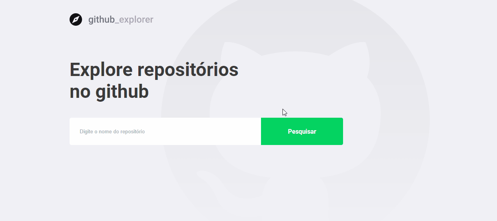

Check this project online: [github explorer](https://githubexplorerexample.netlify.app).

## 🧭 github explorer

With github explorer you can search for repositories on github and find information about them as description, stars, forks and issues.
This project was created as part of GoStack 11, provided by [Rockseat 🚀](https://rocketseat.com.br/) .

### 💻 Technologies

**Framework:** React-native and typescript.

**Libraries and packages:** 
**axios:** Making external calls to APIs. 
**polished:** Used to cause changes in styles in response to user interactions. 
**react-router-dom:** Routing in react. 
**react-icons:** Icon pack for react. 
**styled-components:** Styling library. 
